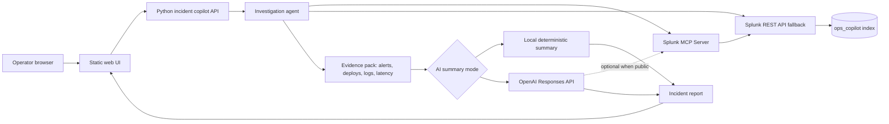

# Architecture

## Data Flow

1. `scripts/load_sample_data.py` creates synthetic production events and writes them into Splunk index `ops_copilot`.
2. The browser calls the Python backend at `/api/investigate`.
3. The backend runs a fixed set of SPL searches through Splunk MCP Server when configured.
4. If MCP is not configured, the backend falls back to the Splunk REST API.
5. Search results are assembled into an evidence pack.
6. If `OPENAI_API_KEY` is configured, the evidence pack is sent to the OpenAI Responses API for incident analysis.
7. If the MCP endpoint is publicly reachable, the model can also call the Splunk MCP Server as a remote MCP tool.
8. Without an OpenAI key, the app returns a deterministic local report so demos still work offline.
